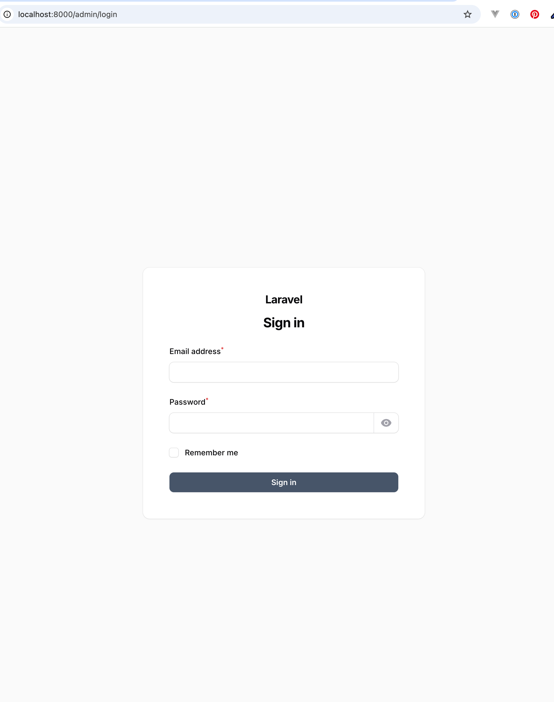
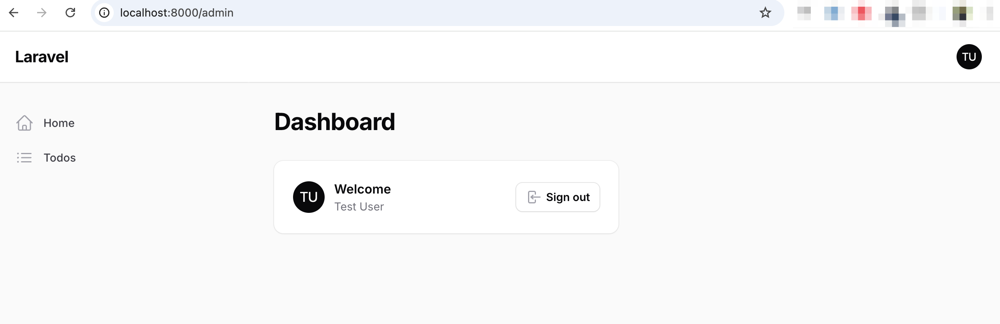
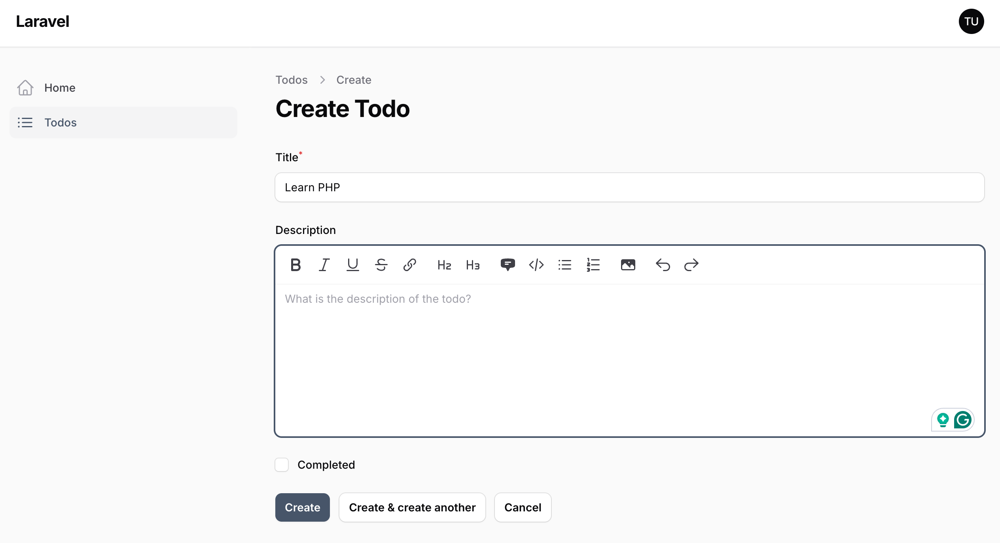
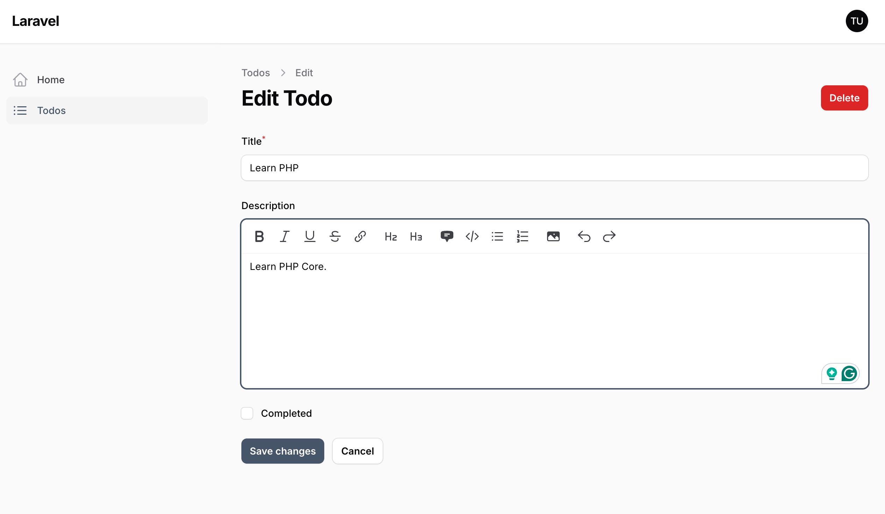
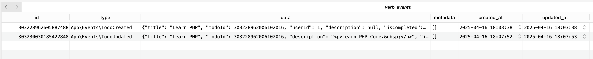
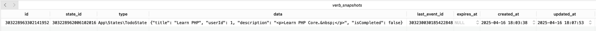
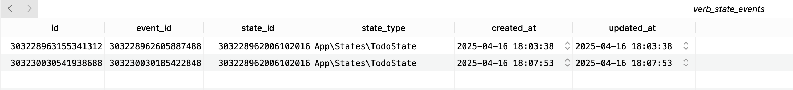
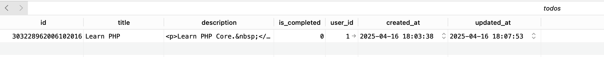
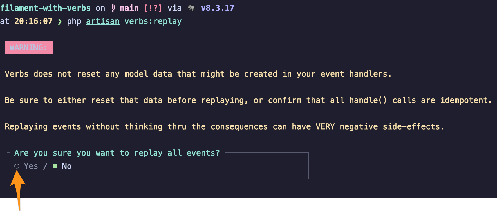
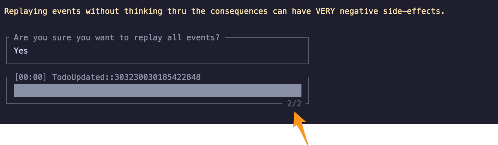

# Filament PHP with Verbs: Event Sourcing in Laravel

## TL;DR

This project demonstrates:
- How to integrate **Filament PHP** (admin panel) with **Verbs** (event sourcing package)
- Implementation of a simple Todo application that uses event sourcing
- Complete event history stored in `verb_events` table
- Ability to rebuild application state from events using `php artisan verbs:replay`
- Practical example of event sourcing benefits (auditability, time-travel debugging, resilience)

This repository demonstrates the integration of [Filament PHP](https://filamentphp.com/) (a powerful admin panel framework) with [Verbs](https://verbs.thunk.dev/) (an event sourcing package for Laravel) through a Todo application example. This project showcases how to implement event sourcing principles in a Laravel application with a beautiful admin interface.

## What is Event Sourcing?

Event sourcing is an architectural pattern that stores all changes to an application's state as a sequence of events. Instead of just storing the current state, it maintains a complete history of all actions that led to the current state. This provides:

- Complete audit trail of all system changes
- Ability to rebuild the system state at any point in time
- Enhanced debugging capabilities
- Resilience to schema changes

## Getting Started

Follow these steps to set up the project:

1. Clone the repository:
   ```bash
   git clone https://github.com/tisuchi/filament-with-verbs.git
   ```

2. Navigate to the project directory:
   ```bash
   cd filament-with-verbs
   ```

3. Set up the environment:
   ```bash
   cp .env.example .env
   php artisan key:generate
   ```

4. Set up the database and seed initial data:
   ```bash
   php artisan migrate:fresh --seed
   ```

5. Start the development server:
   ```bash
   php artisan serve
   ```

6. Access the application at http://localhost:8000

## Admin Panel

### Authentication

Access the admin panel at http://localhost:8000/admin with these credentials:

| Credential | Value             |
|------------|-------------------|
| Email      | `user@example.com` |
| Password   | `password`         |



### Dashboard

The dashboard provides an overview of the application:



### Todo Management

The Todo section allows you to create, update, and manage your tasks:

#### Creating a Todo Item



#### Updating a Todo Item



## Database Architecture with Verbs

The Verbs package implements event sourcing by creating three additional tables alongside your domain tables:

### 1. `verb_events` Table

Stores all events that occur in the system. Each row represents a single event (like TodoCreated, TodoCompleted, etc.) with its data payload.



### 2. `verb_snapshots` Table

Contains point-in-time snapshots of entity states to optimize rebuilding state from events. This prevents having to replay all events from the beginning.



### 3. `verb_state_events` Table

Links events to the specific entities they affect, creating a relationship between states and their events.



### 4. `todos` Table (Domain Table)

The actual domain table that stores the current state of todo items. This is derived from applying all events.



## Event Replay Demonstration

One of the powerful features of event sourcing is the ability to replay events to rebuild state. Here's how to demonstrate this:

1. First, clear the current state by truncating the `todos` table (this simulates data loss in the domain table)

2. Run the replay command to rebuild the state from events:
   ```bash
   php artisan verbs:replay
   ```

3. Confirm that you want to run all events:

   

4. Successful replay notification:

   

5. Verify that the `todos` table has been fully reconstructed with exactly the same data that was there before:

   

This demonstrates the power of event sourcing - even if you lose your entire domain table, you can rebuild it completely from the stored events!

## Behind the Scenes

When you interact with the Todo items through the Filament interface:

1. Actions like creating or updating trigger events
2. These events are stored in the `verb_events` table
3. The events are then applied to update the current state in the `todos` table
4. Periodically, snapshots are created for performance optimization

---

I welcome your questions, feedback, and contributions to this project! Feel free to open issues or pull requests to improve this demonstration.

Thank you for exploring this integration of Filament PHP with Verbs event sourcing.
